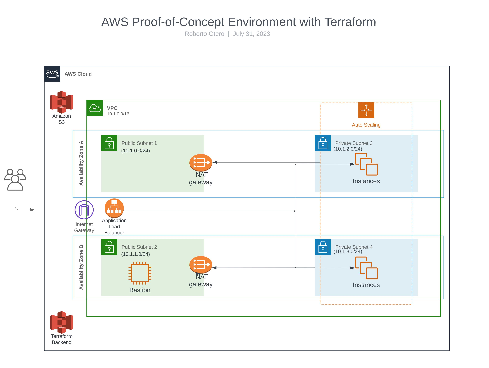

# AWS Terraform POC Environment

## Overview
This repository contains Terraform code that sets up a comprehensive proof-of-concept environment in AWS. The infrastructure is managed using Terraform and includes various components to demonstrate different AWS features and services.

## Components

### VPC and Subnets
- 1 VPC with CIDR block: 10.1.0.0/16
- 4 subnets spread evenly across two availability zones:
   - Sub1 – 10.1.0.0/24 (accessible from the internet)
   - Sub2 – 10.1.1.0/24 (accessible from the internet)
   - Sub3 – 10.1.2.0/24 (not accessible from the internet)
   - Sub4 – 10.1.3.0/24 (not accessible from the internet)

### NAT Gateway Configuration
- Configures two NAT gateways in the VPC for two public subnets, facilitating SSH access to the webservers from a bastion host.

### EC2 Instance
- 1 EC2 instance running Red Hat Linux 9.2 in subnet Sub2
- Configuration:
  - Instance Type: t2.micro
  - Storage: 20 GB

### Auto Scaling Group (ASG)
- 1 Auto Scaling Group that spreads instances across subnets Sub3 and Sub4
- Configuration:
  - AMI: Red Hat Linux 9.2
  - Instance Type: t2.micro
  - Storage: 20 GB
  - Number of Instances: Minimum 2, Maximum 6
- Scripted installation of Apache Web Server (httpd) on ASG instances

### Application Load Balancer (ALB)
- 1 Application Load Balancer (ALB) listening on TCP port 80 (HTTP)
- Forwards traffic to the ASG in subnets Sub3 and Sub4
- Security groups are used to allow necessary traffic

### S3 Bucket with Lifecycle Policies
- 1 S3 bucket with two folders:
  - "Images" folder: Move objects older than 90 days to Glacier.
  - "Logs" folder: Delete objects older than 90 days.

## How to Use the Terraform Code
1. Clone this repository to your local machine.
2. Install Terraform (version >= 0.12, < 0.14) if not already installed.
3. AWS CLI install and instructions: https://docs.aws.amazon.com/cli/latest/userguide/getting-started-install.html
4. Navigate to the `terraform/` directory.
5. Modify the `terraform.tfvars` file to customize the settings based on your requirements.
6. Ensure the `init_webserver.sh` script is executable using `chmod +x init_webserver.sh` before using it in Terraform.
7. Run `terraform init` to initialize the Terraform environment.
8. Run `terraform plan -var-file="terraform.tfvars"` to preview the changes that will be applied.
9. Run `terraform apply -var-file="terraform.tfvars"` to create the AWS environment.

## Clean Up
To remove the created infrastructure and resources, run `terraform destroy -var-file="terraform.tfvars"`.

## Prerequisites
- [Terraform](https://www.terraform.io/downloads.html) installed on your local machine (version >= 0.12, < 0.14).
- AWS IAM user credentials with sufficient permissions to create the infrastructure resources.

## Contact

If you have any questions or need further assistance, feel free to reach out to the project owner:

- Name: Roberto Otero
- Email: rotero82@gmail.com

## License
This project is open-source and licensed under the [MIT License](LICENSE).
